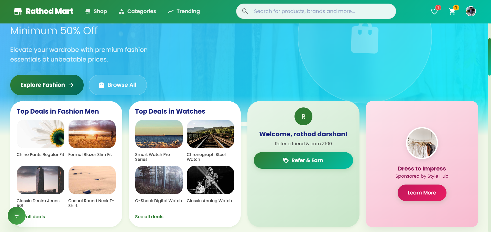
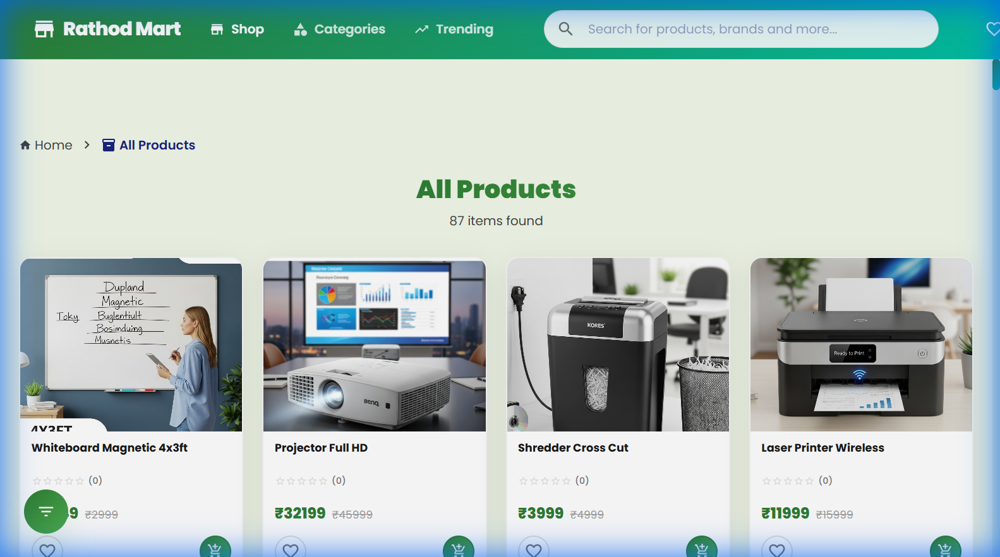
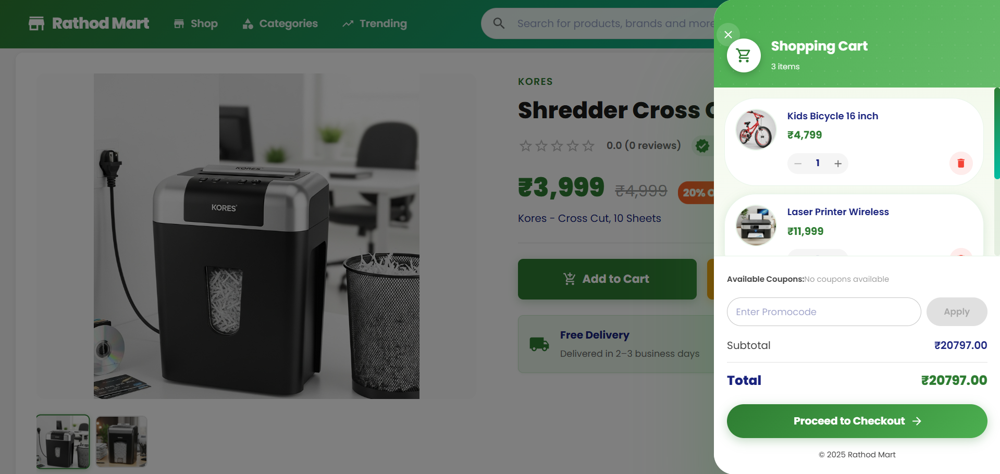
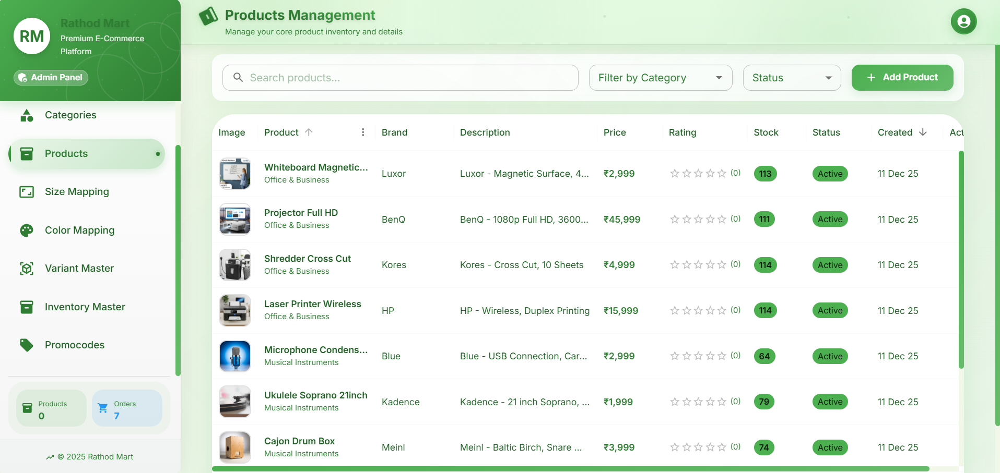
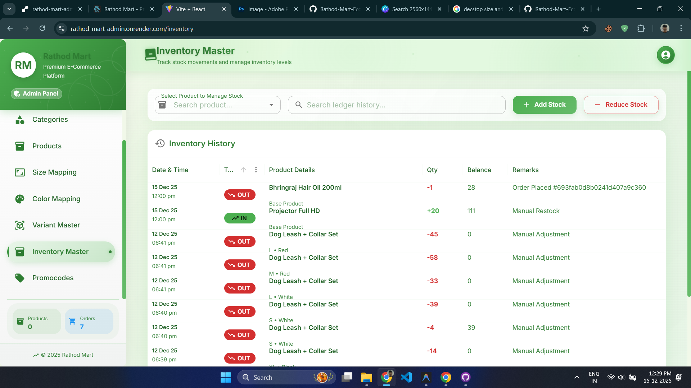
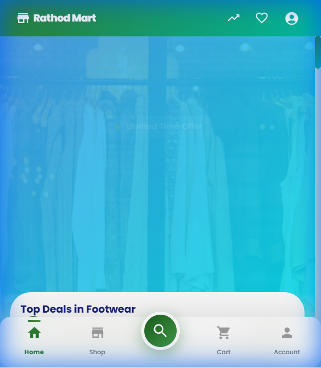
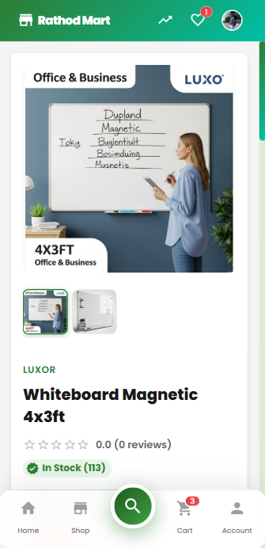

<p align="center">
  
</p>

<h1 align="center">🛒 Rathod Mart - E-Commerce Platform</h1>

<p align="center">
  <strong>A modern, full-stack e-commerce platform built with MERN Stack</strong>
</p>

<p align="center">
  <a href="https://rathod-mart-store.onrender.com">🌐 Live Store</a> •
  <a href="https://rathod-mart-admin.onrender.com">👨‍💼 Admin Panel</a> •
  <a href="https://rathod-mart-backend.onrender.com">⚙️ API</a>
</p>

<p align="center">
  
  
  
  
</p>

<p align="center">
  
  
  
  
</p>

---

## 📸 Screenshots

<p align="center">
  
</p>

<details>
<summary>🖥️ Desktop Screenshots</summary>

### Customer Store
<table>
  <tr>
    <td align="center"><b>Home Page</b></td>
    <td align="center"><b>Products</b></td>
    <td align="center"><b>Cart</b></td>
  </tr>
  <tr>
    <td></td>
    <td></td>
    <td></td>
  </tr>
</table>

### Admin Panel
<table>
  <tr>
    <td align="center"><b>Dashboard</b></td>
    <td align="center"><b>Products</b></td>
    <td align="center"><b>Orders</b></td>
  </tr>
  <tr>
    <td></td>
    <td></td>
    <td></td>
  </tr>
</table>

</details>

<details>
<summary>📱 Mobile Responsive Screenshots</summary>

<table>
  <tr>
    <td align="center"><b>Mobile Home</b></td>
    <td align="center"><b>Mobile Products</b></td>
  </tr>
  <tr>
    <td></td>
    <td></td>
  </tr>
</table>

</details>

---

## ✨ Features

### 🛍️ Customer Store
| Feature | Description |
|---------|-------------|
| 🔐 **Google OAuth** | One-click login with Google |
| 🛒 **Smart Cart** | Add, remove, update quantities |
| ❤️ **Wishlist** | Save products for later |
| 🔍 **Advanced Search** | Filter by category, price, size |
| 📱 **Responsive Design** | Beautiful on all devices |
| 🎨 **Modern UI** | Glassmorphism, animations |
| 💳 **Easy Checkout** | Simple checkout process |
| ⭐ **Product Reviews** | Rate and review products |

### 👨‍💼 Admin Panel
| Feature | Description |
|---------|-------------|
| 📊 **Dashboard** | Sales analytics & stats |
| 📦 **Product Management** | CRUD with image upload |
| 📁 **Category Management** | Nested categories |
| 👥 **User Management** | Customer & staff roles |
| 🏷️ **Promo Codes** | Create discount codes |
| 📋 **Order Management** | Track & update orders |
| 📏 **Size/Color Mapping** | Product variants |
| 📈 **Inventory Tracking** | Stock management |

---

## 🛠️ Tech Stack

### Frontend
```
React 18 • Material UI 5 • Redux Toolkit • Framer Motion
React Router 6 • React Hook Form • Yup • Swiper.js
Axios • React Hot Toast • Chart.js
```

### Backend
```
Node.js • Express.js • MongoDB • Mongoose
JWT • Passport.js • Google OAuth 2.0
Cloudinary • Bcrypt • Cookie-Parser
```

### DevOps & Tools
```
Render (Deployment) • MongoDB Atlas • Cloudinary CDN
Git • VS Code • Postman
```

---

## 🚀 Live Demo

| Application | URL | Status |
|-------------|-----|--------|
| 🛍️ **Customer Store** | [rathod-mart-store.onrender.com](https://rathod-mart-store.onrender.com) | ✅ Live |
| 👨‍💼 **Admin Panel** | [rathod-mart-admin.onrender.com](https://rathod-mart-admin.onrender.com) | ✅ Live |
| ⚙️ **Backend API** | [rathod-mart-backend.onrender.com](https://rathod-mart-backend.onrender.com) | ✅ Live |

---

## 📁 Project Structure

```
Rathod-Mart-Ecommerce/
├── 📂 rathod-mart-frontend/     # Customer Store (React)
│   ├── src/
│   │   ├── components/          # Reusable UI components
│   │   ├── pages/               # Page components
│   │   ├── store/               # Redux store
│   │   ├── context/             # React contexts
│   │   └── data/                # API services
│   └── public/
│
├── 📂 rathod-mart-admin/
│   ├── 📂 frontend/             # Admin Panel (React + Vite)
│   │   ├── src/
│   │   │   ├── components/      # Admin components
│   │   │   ├── pages/           # Admin pages
│   │   │   └── services/        # API services
│   │   └── public/
│   │
│   └── 📂 backend/              # API Server (Express)
│       ├── config/              # Database & passport config
│       ├── controllers/         # Route controllers
│       ├── middleware/          # Auth & error handlers
│       ├── models/              # Mongoose models
│       ├── routes/              # API routes
│       └── utils/               # Helper functions
│
└── 📂 screenshots/              # Project screenshots
```

---

## ⚡ Quick Start

### Prerequisites
- Node.js 18+
- MongoDB Atlas account
- Cloudinary account
- Google OAuth credentials

### Installation

```bash
# Clone the repository
git clone https://github.com/yourusername/Rathod-Mart-Ecommerce.git
cd Rathod-Mart-Ecommerce

# Install Backend dependencies
cd rathod-mart-admin/backend
npm install

# Install Admin Frontend dependencies
cd ../frontend
npm install

# Install Customer Frontend dependencies
cd ../../rathod-mart-frontend
npm install
```

### Environment Variables

Create `.env` files in each project:

**Backend** (`rathod-mart-admin/backend/.env`):
```env
NODE_ENV=development
PORT=5000
MONGO_URI=your_mongodb_uri
JWT_SECRET=your_jwt_secret
CLOUDINARY_CLOUD_NAME=your_cloud_name
CLOUDINARY_API_KEY=your_api_key
CLOUDINARY_API_SECRET=your_api_secret
FRONTEND_URL=http://localhost:3000
GOOGLE_CLIENT_ID=your_google_client_id
GOOGLE_CLIENT_SECRET=your_google_client_secret
```

### Run Development Servers

```bash
# Terminal 1 - Backend (Port 5000)
cd rathod-mart-admin/backend
npm start

# Terminal 2 - Admin Panel (Port 5173)
cd rathod-mart-admin/frontend
npm run dev

# Terminal 3 - Customer Store (Port 3000)
cd rathod-mart-frontend
npm start
```

---

## 🔗 API Endpoints

<details>
<summary>📋 View API Routes</summary>

### Authentication
| Method | Endpoint | Description |
|--------|----------|-------------|
| POST | `/api/users/register` | Register new user |
| POST | `/api/users/login` | Login user |
| GET | `/api/users/google` | Google OAuth |
| POST | `/api/users/logout` | Logout user |

### Products
| Method | Endpoint | Description |
|--------|----------|-------------|
| GET | `/api/products` | Get all products |
| GET | `/api/products/:id` | Get single product |
| POST | `/api/products` | Create product (Admin) |
| PUT | `/api/products/:id` | Update product (Admin) |
| DELETE | `/api/products/:id` | Delete product (Admin) |

### Cart & Wishlist
| Method | Endpoint | Description |
|--------|----------|-------------|
| GET | `/api/cart` | Get user cart |
| POST | `/api/cart` | Add to cart |
| GET | `/api/wishlist` | Get user wishlist |
| POST | `/api/wishlist` | Add to wishlist |

</details>

---

## 👨‍💻 Author

<p align="center">
  
</p>

<p align="center">
  <strong>Darshan Rathod</strong>
</p>

<p align="center">
  <a href="https://github.com/darshanrathod27">
    
  </a>
  <a href="https://linkedin.com/in/darshanrathod27">
    
  </a>
</p>

---

## 📄 License

This project is licensed under the MIT License - see the [LICENSE](LICENSE) file for details.

---

<p align="center">
  Made with ❤️ by <a href="https://github.com/darshanrathod27">Darshan Rathod</a>
</p>

<p align="center">
  ⭐ Star this repo if you like it!
</p>
